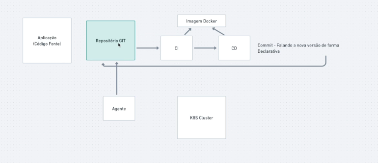

# GitOps

    É uma pratica, onde estamos sempre trabalhando com sistemas declarativos, então utilizamos todo o poder do git, omde 
garantimos o que está rondando no projeto Git, é o que está rodando em produção.
Onde temos o repositorio Git, atraves do processo de CI, iremos chamar o processo de CD que irá pegar a imagem gerada
pelo processo de CI, e assim o processo do CD irá atualizar outro repositorio Git com as configurações de Infra, e lá 
temos um agente que fica escutando esse repositorio, em tempos em tempos, e assim que detecta uma mudança, ele mediatamente
tambem atualiza produçào.
    

    