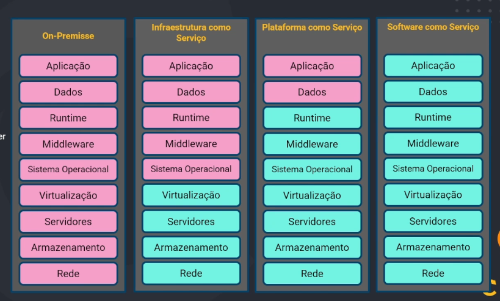

# Cloud Providers

Questoe de custo, onde so se paga pelo que usou
Questou de logistica, para provisonar servidores, e manutenção, e escalonar mais recursos para o servidores

Tipos de modelos de servidores:

Região: é uma area onde a empresa de cloud tem os seus datacenters, uma area no mundo, quanto mais perto, melhor para
fins de latencia, já que a comunicação feita percorrerá um caminho menor. 

Zona de Dusponibilidade: é um local onde existe realmente a infraestrutura, datacenter e servidores, a Zona se refere
a mais de uma região, é normal ter mais de um datacenter por região. Por questões de disponibilidade é normal que uma
região supra as necessidades da outra, em caso de queda quando houver.

Zona Local: são pequenos locais de infraestrutura onde se dimuni a distrancia de comunicação para assim fazer a ponte
de comunicação entre a zona e a região posteriormente. Não são todos os serviços que estão disponiveis da zona local.

Wavelenghth: é mais usado para dados moveis, dispositivos mobile. Por have um intermediario, a torre da operadora, a
latencia, ou seja, o tempo de reposta é ainda maior. Muitos caso é necessário ter um tempo de reposta rapido, até mesmo
por questões de segurança ou até mesmo para a experiencia do cliente. A Waveleghth é uma infraestrutura direto na operadora
para assim ter o tempo de resposta ainda melhor.

